# Ejercicio Final

## 🎯 Objetivo de la práctica:

Al finalizar la práctica, serás capaz de:

- Aplicar los conocimientos adquiridos durante el curso mediante la creación de un mini proyecto que emule un reporte, el cual, actualmente ya es utilizado.

## ⏱️ Duración aproximada:

El tiempo requerido para completar este ejercicio dependerá de la experiencia y familiaridad del usuario con Power BI. Sin embargo, se estima que, para quienes lo utilizan por primera vez, la realización exitosa del ejercicio puede tomar aproximadamente **6 horas**.

## 📄 Planteamiento del ejercicio

Como parte de tus actividades, debes elaborar el borrador de un reporte de seguimiento de solicitudes de crédito en Power BI Desktop. El objetivo es analizar el desempeño de las solicitudes, comparando los resultados mes a mes.

En este primer borrador, deberás incluir un análisis de datos básicos, como el número de solicitudes aprobadas, las regiones y sucursales de origen, entre otros detalles. Ten en cuenta que estos datos no son definitivos, ya que el reporte es una prueba de concepto.

## ⚙️ Metodología:

Esta actividad está diseñada para realizarse de manera estructurada, como se trabajó durante el curso. Sin embargo, las instrucciones no serán tan detalladas, esto con el objetivo de reforzar la aplicación de los conocimientos adquiridos sin depender de una guía paso a paso.

## 📊 Criterios de evaluación:

Los criterios de evaluación se basan en la presentación de las evidencias solicitadas, asegurando que el trabajo del participante sea igual o, al menos, similar a la imagen de referencia proporcionada. Además, se considerará la coherencia de los datos, garantizando que no presenten anomalías.

## 📋 Actividades a realizar:

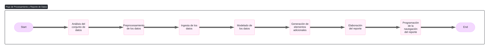

Comenzaremos el análisis de datos utilizando el archivo ***Datos para Funnel - Abril 2025- SIF+POS*** como referencia. A partir de este, podremos extraer información relevante y avanzar en la fase de evaluación.

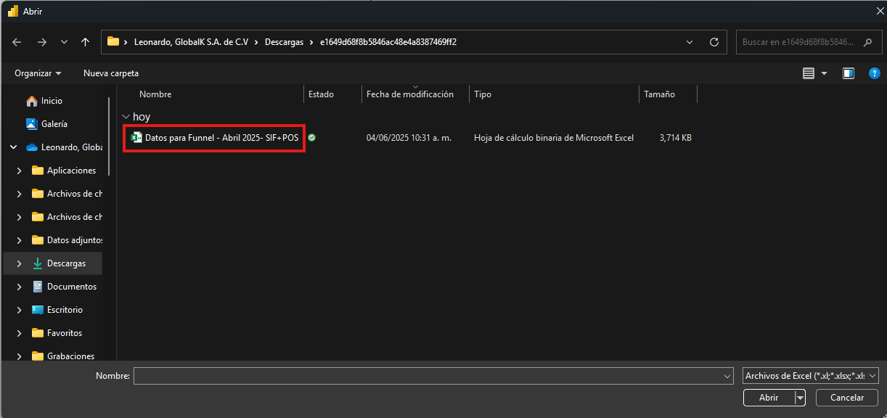

## Fase de análisis

Para iniciar, abre la aplicación ***Power BI Desktop*** e importa los datos.

Al momento de la importación de los posibles datos para el análisis, notarás que la herramienta ***Power Query*** te muestra varias consultas, las cuales puedes utilizar para obtener los datos y exceden las hojas originales del archivo.

Dado lo anterior, te solicitan que importes solo aquellas que realmente sean útiles para analizar la información. Posteriormente, deberás realizar una serie de pasos para organizar los datos y dejarlos en un estado óptimo para generar el reporte.

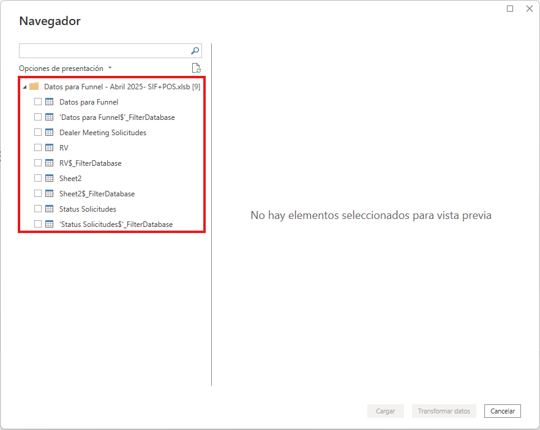

Como nota, te mencionan que aquellas consultas que incluyen ***$_FilterTable*** no son necesarias para el estudio, ya que son similares a las otras con nombre similar. Por lo tanto, de las 9 posibles consultas, ahora solo tendrás 5 opciones de para analizar y determinar cuáles utilizar para el estudio.

Al término de este primer paso, deberás trabajar con una única consulta.

---

Ahora que has identificado cuál es la consulta que utilizarás para  procesar la información, es momento de examinarla y poder determinar si los datos están listos para utilizarlos.

**¿Observas algo inusual en las columnas de la consulta?**

- ¿Existen columnas con nombres similares?
- ¿En qué se diferencian esas columnas?
- Del resto de las columnas:
  - ¿Qué puedes observar?
  - ¿Hay columnas sin valores?
- ¿Detectas valores atípicos en alguna columna? Por ejemplo, en la columna...

***External reference***.

  - ¿Notas algún valor inusual?
  - ¿Puedes identificar qué representa el valor **1** en esta columna?

- Para la columna ***AA***:
  - ¿Qué observa?
  - ¿Todas las filas contienen valores?
  - ¿Qué valores tienen las columnas? 

- Examina de manera similar las siguientes columnas:
  - ***Bussiness Partner***,
  - ***Nombre del cliente***,
  - ***Plazo***, ***Loan value amount***,
  - ***Buckets monto*** y
  - ***RESULTADO SCORE***.

- Para la columna ***Producto***, ¿puedes distinguir el significado de los valores 1, 2 y 3?

- Observa las columnas ***Mes de pago*** y ***Mes de solicitud***.
  - ¿Que diferencia notas entre ellas?
  - ¿Son del mismo tipo de dato?

## Preprocesamiento de los datos

Con base en tus observaciones, procede a modificar la consulta para mejorar el modelo. A continuación, se presentan algunas sugerencias de transformaciones necesarias para lograr un análisis adecuado.

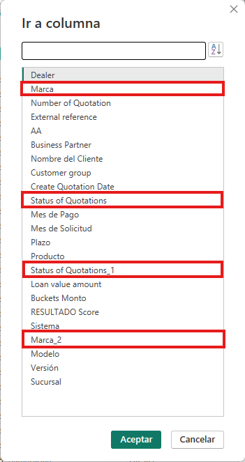

Para la primer pareja de columnas con el mismo nombre:
- Selecciona alguna de las dos columnas ***Marca*** y elimina la otra.
- En la columna resultante, aplica los siguientes cambios:
  - Nombre de la columna: ***Marca***.
  - Los valores de la columna no deben estar abreviados y todos los posibles valores para una marca deben estar homologados.
  - Los valores vacíos no deben ser considerados para este análisis.
  - Solo se inclirán vehículos que pertenecen al grupo de Volkswagen; todos aquellos de otras marcas, deben omitirse.

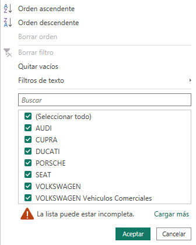

Para la segunda pareja de columnas:
- Elimina la columna que solo contiene un valor repetido.
- Renombra la columna restante como: ***Estado de la cotización***.

Para los valores de la columna ***Producto***, intenta a reemplazarlos de la siguiente manera:
- 1 ➡️ Leasing
- 2 ➡️ Credit
- 3 ➡️ Finance / Premium credit

Finalmente, para las columnas de ***Mes de pago*** y ***Mes de solicitud***:
- Por el momento, no realices cambios en el tipo de dato de ninguna de estas columnas.

Para esta primera parte, el resultado obtenido deberá ser similar al siguientes:

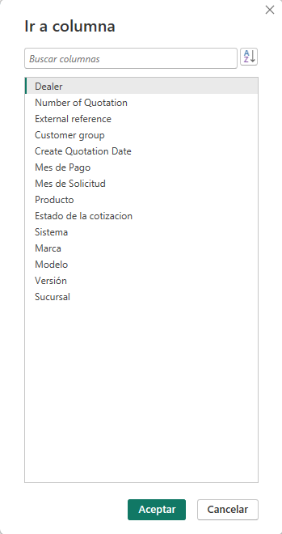

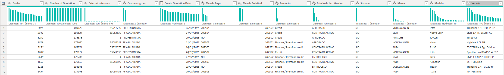

## Ingesta de datos

Si bien ya hemos obtenido los datos para iniciar el modelado de datos, es importante considerar algunas aspectos sobre los datos proporcionados.

- ¿Esta es toda la información necesaria para realizar el análisis?
- ¿Requieres de algún tipo de dato adicional sobre el cliente?
- ¿Es necesario incluir información sobre los gerentes de la sucursal?
- ¿Te interesa obtener información para filtrar por sucursal o por región?

Dado que el equipo responsable de proporcionar los datos enviará la información pendiente más adelante, has decidido avanzar con la creación y modelado de los datos. Para ello, crea tu propia tabla para obtener información que permita filtrar por región geográfica, estado y, eventualmente cuando cuentes con el resto de la información, por sucursal.

Para ello, visita el siguiente enlace:  https://es.wikipedia.org/wiki/Regiones_de_M%C3%A9xico

Importa y manipula los datos de tal forma que la tabla resultante quede con dos columnas: 

1. ***Región***
2. ***Estado***.

Para ello, regresa a ***Power Query*** para importar los nuevos datos.

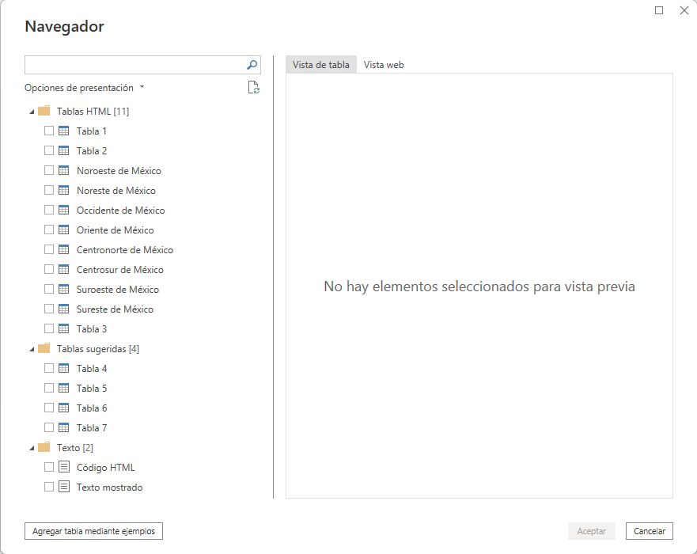

Prueba distintas opciones como ***combinar consultas***, ***anexar columnas*** o ***Agregar tabla mediante ejemplos***.

Debes nombrar la tabla resultante como ***Sucursales*** y deberá quedar de la siguiente manera:

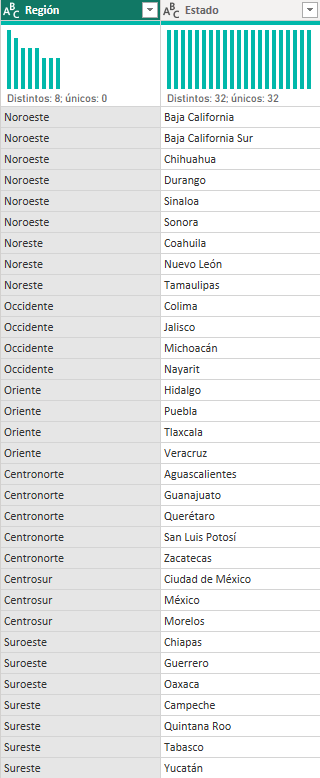

Ahora, el equipo te proporcionará un Excel con la información sobre qué agencias pertenecen a cada estado. Por lo tanto, deberás obtener la información con Power Query y combinar esta nueva consulta con la ya existente. A esta nueva consulta la debes llamar ***Agencias***.

El resultado final deberá verse de la siguiente manera:

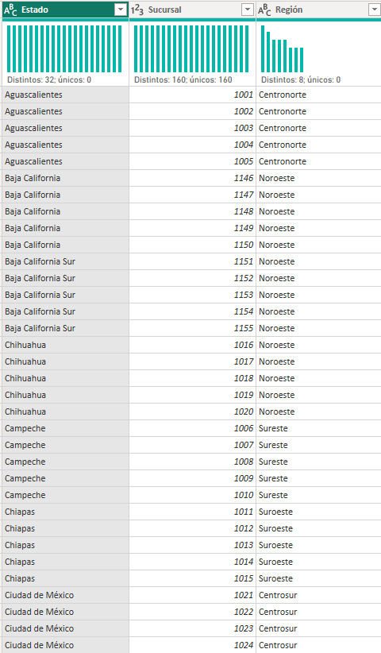

Al momento de ingerir los datos en Power BI, solamente deben aparecer dos consultas: ***Agencias*** y ***Datos para Funnel***.

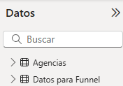

## Modelado de los datos

Ahora crearemos una tabla de fechas para realizar ajustes en el modelo y aprovechar algunas funciones de Time Intelligence. Para ello, dentro de Power BI:

- Cambia a la vista de **Tabla** para generar una nueva tabla calculada, la cual llamarás ***Fecha***.
- Para este ejercicio, asumiremos que el calendario fiscal está alineado con el año natural, es decir, el año fiscal finaliza el 31 de diciembre.

> **Nota:** Recuerda que puedes generar un calendario automático utilizando el método ***CALENDARAUTO()***. Además, no olvides marcar las tablas de fechas como especiales.

A continuación, dentro de la tabla ***Fecha***, crea una nueva columna calculada llamada ***Mes de Solicitud***. Pero, ¿cuál es el propósito de esta nueva columna? ¿Acaso no existe ya una columna similar en la tabla original?

> Recuerda que en este paso aplicamos un *"proceso"* mediante el cual, según la fecha en que se registró la solicitud de crédito, simplemente ***formateamos*** este dato con la parte que nos interesa; por ejemplo: ***enero-25***.
> ¿Recuerdas el formato que tiene la columna ***Mes de solicitud*** en la consulta original? Intenta replicar ese mismo formato en esta nueva columna.

El resultado esperado para esta tabla calculada debe lucir de la siguiente manera:

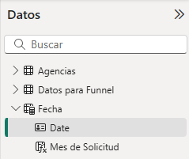

> Recuerda que una de las ventajas de Power BI es el acceso a las funciones de *Time Intelligence*, que nos permiten realizar cálculos muy útiles relacionados con el tiempo. Sin embargo, para poder utilizarlas, es necesario contar con una columna de tipo fecha. Por esta razón, realizamos este paso. 

Como ya has creado tu propia columna ***Mes de Solicitud***, ya no es necesario conservarla dentro de la consulta principal, por lo que puedes eliminarla.

Así, los atributos de las tablas quedarán la siguiente manera:

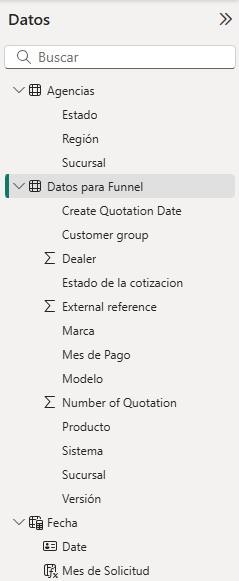

Ahora, en a la *Vista de Modelo*, establece una relación entre la consulta principal y la tabla ***Fecha***.

Luego, haz lo mismo para crear una relación entre la tabla principal y la tabla ***Agencias***.

Las relaciones deberían quedar configuradas de la siguiente manera:

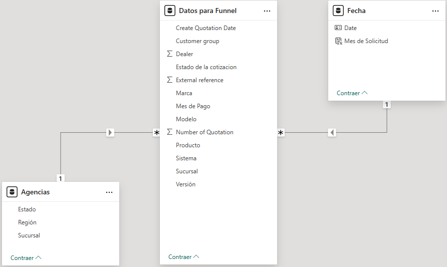

Aunque ya contamos con prácticamente todo lo necesario para analizar la información y elaborar el reporte, debido a ciertos requerimientos adicionales, se debe incorporar algunos elementos más para garantizar un análisis adecuado.

Considerando lo anterior, en la tabla ***Agencias*** sabemos que nos pedirá realizar una investigación a distintos niveles: regional, estatal y por sucursal o agencia. Por ello, se solicita elaborar un elemento que permita aplicar estos filtros de forma ágil, sin necesidad de añadir distintos filtros. Este resultado lo debes nombrar ***Niveles estudio***.

> Esta descripción sugiere una forma de organizar la información mediante una estructura de ***Jerarquía***.

Dentro de la tabla principal, algunos campos se resumen de forma automática, pero la forma en que lo hacen no es de forma precisa. Por ello, modifica la forma en la que se resumen estos datos para realizarlo de una manera distinta a una simple suma, por ejemplo, intentando resumir entre ***Recuento*** y ***Recuento (distintivo)***.

> La vista de datos puede ayudarte a definir algunos atributos de los datos dentro del análisis.

Para ello, se solicita clasificar el estatus de las solicitudes de la siguiente manera:

- Las solicitudes con estado **APROBADO** o **CONTRATO ACTIVO** deberán contarse como ***Autorizadas***.
- Las que estén en **EN PROCESO** o **REVISIÓN DOCUMENTOS** se clasificarán como ***Revisión***.
- Todas las demás se considerarán como ***Rechazadas***.

> Esta descripción corresponde a una forma de ***agrupar los datos***, por lo que le llamaremos ***Estatus***.

Ahora, se solicita elaborar una medida que permita realizar el seguimiento mensual del porcentaje de cambio en la cantidad de solicitudes, comparando un mes con el anterior.

Puedes desarrollarutilizando una **medida explícita** o **medida rápida**.

> **Nota:** Recuerda que las medidas rápidas se crean mediante medios gráficos; por el contrario, las medidas explícitas se construyen directamente con código.

Hasta este punto, deberías contar con algo similar a la siguiente imagen:

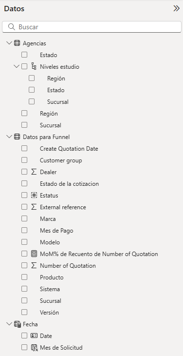

## Elaboración del reporte

Ahora que ya contamos con algunos datos, comenzarás a diseñar parte del reporte.

Por ejemplo, se te indican que deben incluirse distintos filtros visuales que permitan ver la información según los siguientes criterios: ***Marca***, ***Región***, ***Estado*** y ***Agencia***.

Además, se solicita incluir un gráfico de columnas apiladas para identificar el porcentaje de solicitudes por mes, con los siguientes lineamientos:

- Cada mes debe mostrar los valores agrupados.
- Las categorías que son Autorizadas o en Revisión, deben estar ordenados cronológicamente por mes.
- El porcentaje de cada categoría deben consultarse con base en el total del mes, y no sobre el total general de los datos.

> Considerando lo anterior, aquí tienes algunas pistas o elementos clave a considerar para lograr el resultado esperado:  
- El eje X debe basasrse en el ***Mes de la solicitud***. Sin embargo, dependiendo el tipo de dato que se le haya asignado, el orden podría ser alfabético o cronológico. Para solucionarlo, puede ser necesario crear una columna adicional en la tabla ***Fecha***: uno sea el que se muestra y el otro el que ordena.
- El eje Y muestra los datos de las solicitudes; sin embargo, se busca mostrar por promedio. De usar las opciones directas del gráfico, se puede mostrar un porcentaje general. No obstante, nosotros queremos un porcentaje que considere un cierto contexto, por lo tanto, necesitamos una medida.
- Para que la herramienta muestre los colores por estado de la solicitud, es necesario agregar dicho campo, No olvides que, si se agrega directamente el campo ***Estado de la cotización***, generará más categorías de las requeridas. Por lo que el grupo que creamos anteriormente, es lo que se debe utilizar.

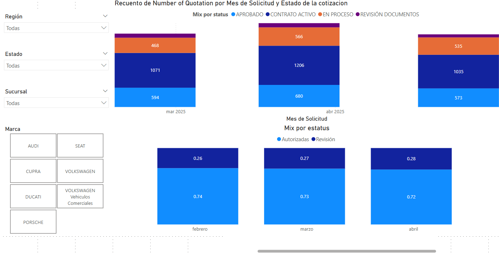

> La imagen superior muestra una imagen de referencia de lo que probablemente se otendrá en un primer intento de construir la visualización deseada. Sin embargo, el objetivo es lograr la creación de la visualización, tal como se muestra en la parte inferior.

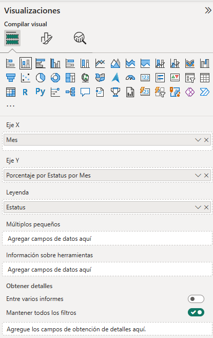

> ***Mes*** es una nueva columna en la tabla de ***Fecha***.

> ***Porcentaje por Estatus por Mes*** es una nueva medida:  

```
Porcentaje por Estatus por Mes = 
DIVIDE(
    CALCULATE(COUNT('Datos para Funnel'[Number of Quotation])),
    CALCULATE(
        COUNT('Datos para Funnel'[Number of Quotation]),
        ALLEXCEPT('Datos para Funnel', 'Fecha'[Mes])
    ),
    0
)
```

Ahora se nos solicita crear un gráfico de embudo para visualizar la cantidad de solicitudes.
Este gráfico debe permitir profundizar el análisis de manera jerárquica, siguiendo el siguiente orden:

1. Mes
2. Estatus (Autorizadas, Revisión, Rechazadas)
3. Estado de la cotización

No se requieren modificaciones adicionales, más allá de asegurar que el gráfico muestre correctamente esta información en el orden indicado.

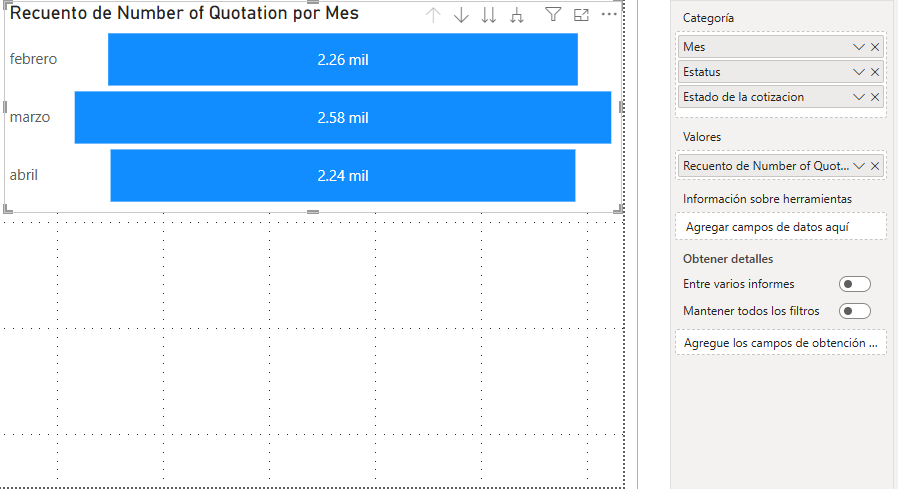

También se solicita incluir una matriz que muestre los datos en crudo, con el fin de observar cómo van variando los valores a lo largo del tiempo. Esta matriz debe incluir el recuento de las solicitudes y el cambio MoM%.

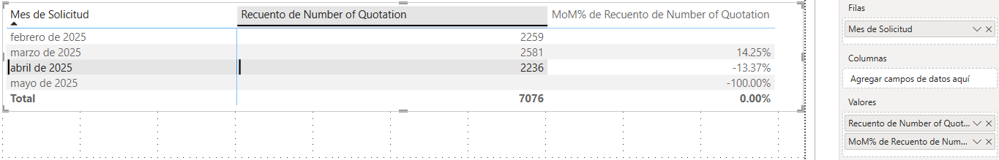

Adicionalmente, se nos solicita crear tres marcadores que permitan mostrar exclusivamente la información correspondiente a los meses de febrero, marzo y abril.
Para facilitar la navegación entre ellos, se deben incorporar botones de navegación.

Por último, se debe personalizar la vista de la primera página del reporte, aplicando un color de fondo azul y colocando el logo de la empresa en la esquina superior izquierda.

El resultado final debe lucir similar a la siguiente referencia visual.

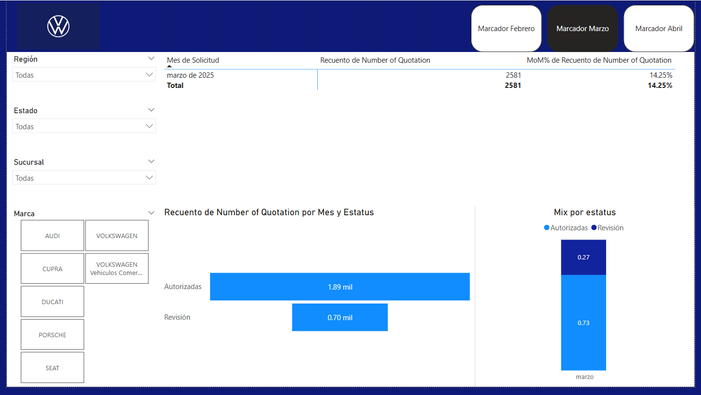

**¡Felicidades!** Has completado este laboratorio.

Has logrado desarrollar un reporte a partir de instrucciones generales, lo que te permitirá comprender y aplicar estos mismos principios cuando necesites crear tus propios reportes.
